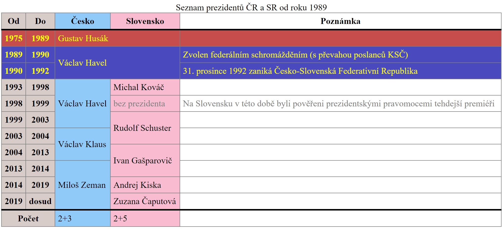

# Prezidenti ČR a SR
Vytvořte a naformátujte tabulku podle vzoru.

## Vlastnosti
Tabulka je na celou šířku obrazovky, mezi jednotlivými buňkami nejsou žádné mezery.
Kolem každé buňky je slabý okraj.
Hlavičkové buňky jsou tučně, datové normální silou písma.
Záhlaví a zápatí tabulky je od obsahu odděleno silnou čarou.
Období vlády komunistického režimu je formátováno jako žlutý text na červeném pozadí (``#c74d4d``). Těchto prezidentů může být i více – tabulka je krácena pro nedostatek času.
Období společného československého státu je označeno žlutým textem na modrém pozadí ``#4a4abe``.
Doba, kdy na Slovensku nebyl žádný prezident, je psána šedou.
Roky mají světle hnědé pozadí: ``#D7CCC8``.
Prezidenti ČR mají jméno na světle modrém pozadí: ``#90CAF9``
Prezidenti ČR mají jméno na růžovém pozadí: ``#F8BBD0``

## Poznámky
Veškeré rozmístěné třídy se týkají pouze řádků, skupin řádků, sloupců a skupin sloupců. Není nutné umísťovat třídy do samotných buněk.
Tabulka má popisek.
Vyzkoušejte si rozdělení na ``thead``, více ``tbody`` (komunističtí, federální, ČR+SR prezidenti) a ``tfoot``
Vertikální formát provádějte pomocí ``<col>`` a ``<colgroup>``
